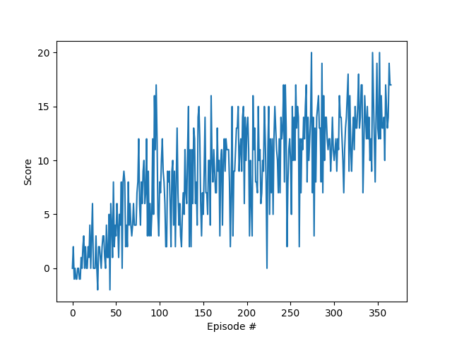
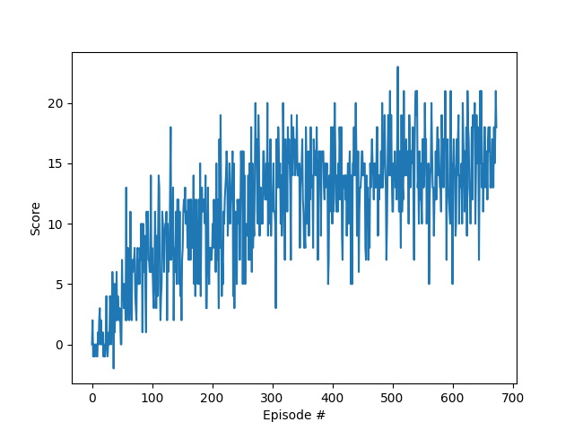

# Table of contents

- [Implementation](#implementation)
    - [Parameters](#parameters)
    - [Network architecture](#network-architecture)
    - [Learning algorithm](#learning-algorithm)
- [Results](#results)
- [Future Work](#future-work)

# Implementation

To solve the Banana World problem, I implemented
a [Deep Q-Network](https://storage.googleapis.com/deepmind-media/dqn/DQNNaturePaper.pdf). The parameters, network
architecture, and learning algorithm are described below.

## Parameters

- `Learning rate`: 1e-4
- `Step-size for soft update`: 1e-3
- `Discount rate`: 0.99
- `Update target every ... episodes`: 4
- `Minibatch size`: 64

I used an Epsilon-greedy policy represented by the [class](src/epsilon_policies.py) `DecayEpsilonGreedy`, which 
resembles the following code:
```python
class DecayEpsilonGreedy:
    epsilon_min: float
    epsilon_decay_rate: float
    epsilon: float
    
    def step(self, time_step: int) -> float:
        self.epsilon *= self.epsilon_decay_rate
        self.epsilon = max(self.epsilon, self.epsilon_min)
        return self.epsilon
```
The step method is called after every time step, updating and returning the value of epsilon.

## Network architecture

The model used to estimate the action-value function had the following configuration:

1. `Linear(in_features=37, out_features=64)`
2. `ReLU()`
3. `Linear(in_features=64, out_features=128)`
4. `ReLU()`
5. `Linear(in_features=128, out_features=256)`
6. `ReLU()`
7. `Linear(in_features=256, out_features=256)`
8. `ReLU()`
9. `Linear(in_features=256, out_features=256)`
10. `ReLU()`
11. `Linear(in_features=256, out_features=64)`
12. `ReLU()`
13. `Linear(in_features=64, out_features=4)`

## Learning algorithm

The learning algorithm used was
the [Deep Q-Network](https://storage.googleapis.com/deepmind-media/dqn/DQNNaturePaper.pdf). The algorithm stands out for
the usage of an Experience Replay buffer, and a secondary network that serves as the target estimate during training.
The experience replay buffer stores an experience (current state, action taken, reward received and next state) to be
used by the agent during the learning process later. The target network has the same architecture as the local network,
but its parameters are only updated every `C`
episodes (in this project `C=4`).

Whenever the target network is updated, a minibatch of experiences are pulled from the replay buffer. Then, the estimate
action-values for these experiences are calculated for each network. The loss is calculated from the Mean Squared Error
between these estimated action-values. Finally, the local network weights are updated through stochastic gradient
descent, while the target network weights are soft-updated with a constant `tau` (in this project, I used tau=1e-3).
This process can become more clear by reading the [code file](src/agent.py).

# Results

The environment was solved in `266` episodes, achieving the average score of `13.0` over the next `100` episodes.

When the goal average score over the last `100` episodes was set to `15.0`, the agent achieved it after `574`
episodes. The following gif is a demonstration of the agent performing in the environment.

<p align="center">
    
    <p align="center">Agent trained with the average score of 15.0</p>
</p>

The score values over each episode are described by the following figure.

<p align="center">
    
    <p align="center">Scores plot with agent trained to reach the average score of 13.0</p>
</p>

<p align="center">
    
    <p align="center">Scores plot with agent trained to reach the average score of 15.0</p>
</p>

# Future work

To better understand the state of the art for reinforcement learning with nonlinear approximation functions, it is
interesting to compare the results obtained with other methods, like Dueling DQNs, Double DQNs and using Prioritized
Experience Replay. There is also the challenge of solving this environment with image data, which is harder and will
prove a valuable exercise to solidify acquired knowledge.
